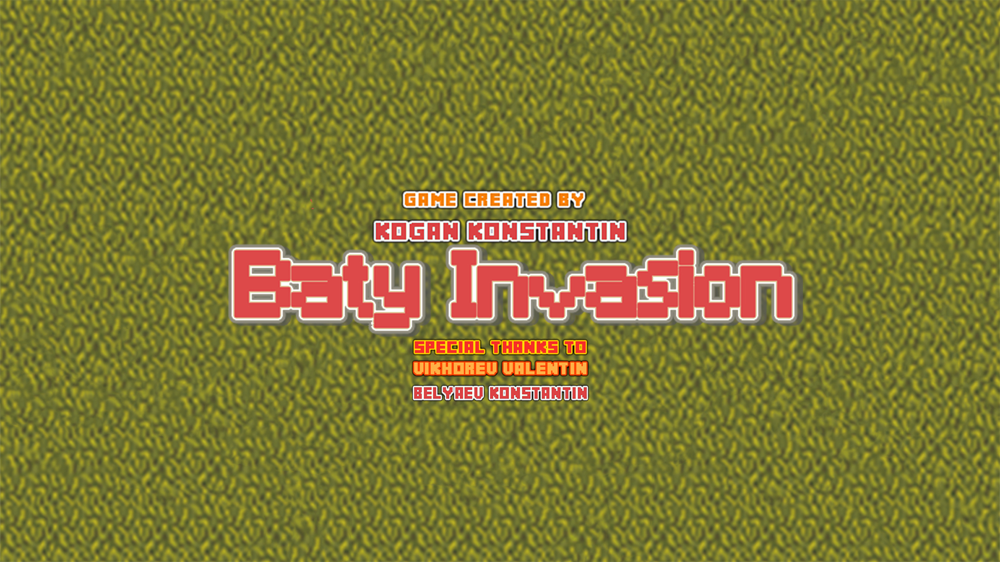
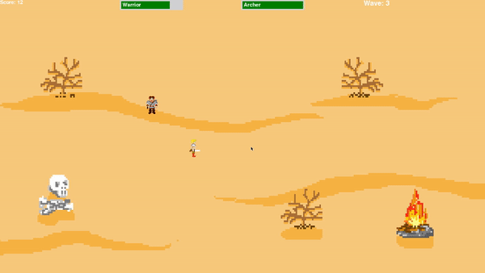

# **Проект**
**Baty invasion** 

*Идея*: 2д игра с авторскими саундтреком и текстурами  
*Тематика* - времена Древней Руси и Батыева нашествия

## Геймплей:

## Задачи:
* Pygame - изучить
* Объектно- ориентированное программирование в Python
* В конце: написать саундтрек, нарисовать текстурки

## Описание:
* 2-Д ИГРА с видом сверху
* 2 игрока бегают по полю
* По сторонам поля будут проходы, из которых будут выходить татаро-монголы
* Татаро-монголы будут выходить по волнам
* Чтобы перейти к следующей волне, необходимо убить какое то количество татаро-монгол
* Каждые 5 волн приходит босс - Шынгыс.
* В игре будут предусмотрены бонусы, которые также будут рандомно появляться после смерти врагов
* Один игрок - с мечом(бьет на одну клетку, здоровья больше), второй - лучник(стреляет по из лука, чуть меньше здоровья)

## Управление:
### Алёша Попович:
* WASD - движение
* F - удар мечом
### Илья Муромец:
* ARROWS - движение
* SPACE - выстрел из лука

## Бонусы:
* Крест - воскрешает союзника
* Землица Русская - восполняет здоровье
* Подкова любимого коня - ускоряет на 10 секунд

## Музыка - Вихорев Валентин

## Спрайты - Беляев Константин, Коган Константин
